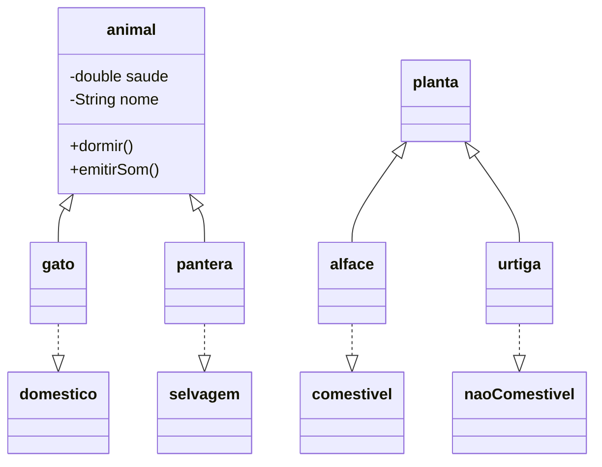

# Modelo de Zoológico em Java

Exercício de programação orientada a objetos que modela animais e plantas de um zoológico, explorando herança, interfaces e comportamentos específicos de cada tipo.

## Conceitos praticados

- Herança entre classes de animais e plantas.
- Interfaces para comportamentos, como ser doméstico, selvagem ou comestível.
- Encapsulamento de atributos e comportamentos.
- Polimorfismo em tipos do domínio.

## Diagrama de classes



## Estrutura

```text
src/
├── animal.java
├── gato.java
├── pantera.java
├── planta.java
├── alface.java
├── urtiga.java
├── domestico.java
├── selvagem.java
├── comestivel.java
└── naoComestivel.java
```

## Execução

O repositório atual é um modelo de domínio e não possui uma classe `Main` para iniciar uma demonstração. Para executá-lo, o próximo passo recomendado é adicionar uma classe principal que instancie os objetos e evidencie os comportamentos de cada tipo.
